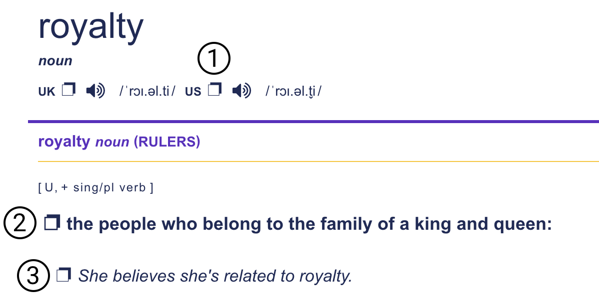
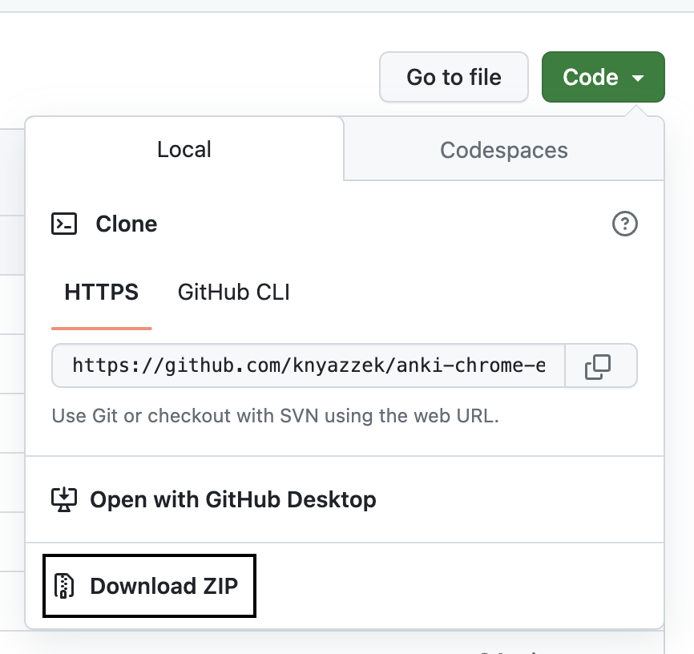
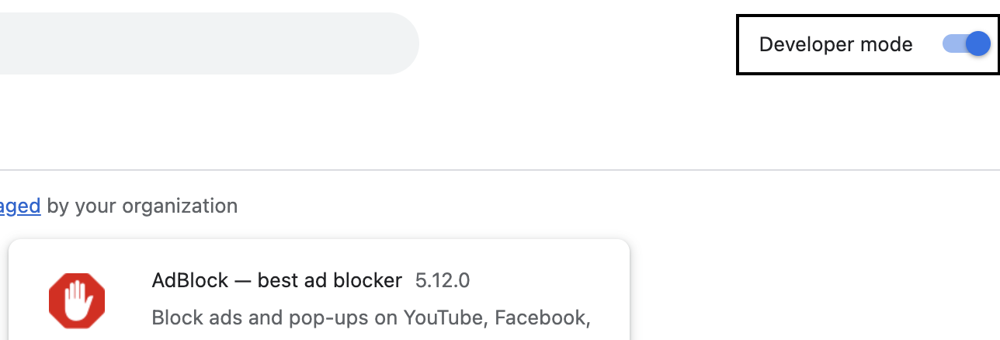
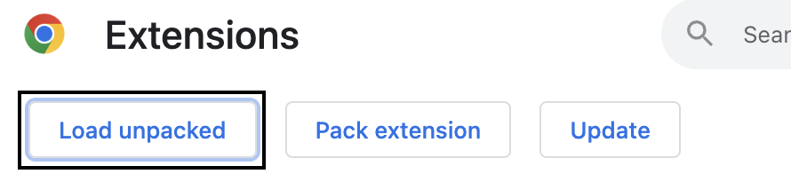

# Anki Chrome Extension

This extension helps to speed up the process of creating Anki flash cards for learning English when take material from the [Cambridge Dictionary](https://dictionary.cambridge.org/) website.

## What exactly does this extension do?

The extension adds additional copy buttons to the webpage that copy elements to the clipboard as shown on the picture below:

1. Copy url of the mp3.
2. Copy definition of the word.

It adds the word itself on the left side and type of the word on the right side. In this specific case it will be:

> royalty - the people who belong to the family of a king and queen: noun

If the definition already contains the word then it will be without word's title on the lift side.

3. Copy specific example of the word.

## How to install?

You’ll have to download the content of the repository and unzip it:

Once you have your folder, go to chrome://extensions (or find it in your menu in more tools > extensions), then activate the developer mode on the top right of the page:

Then to install the extension, you just have to indicate where is this folder on your computer:

Done